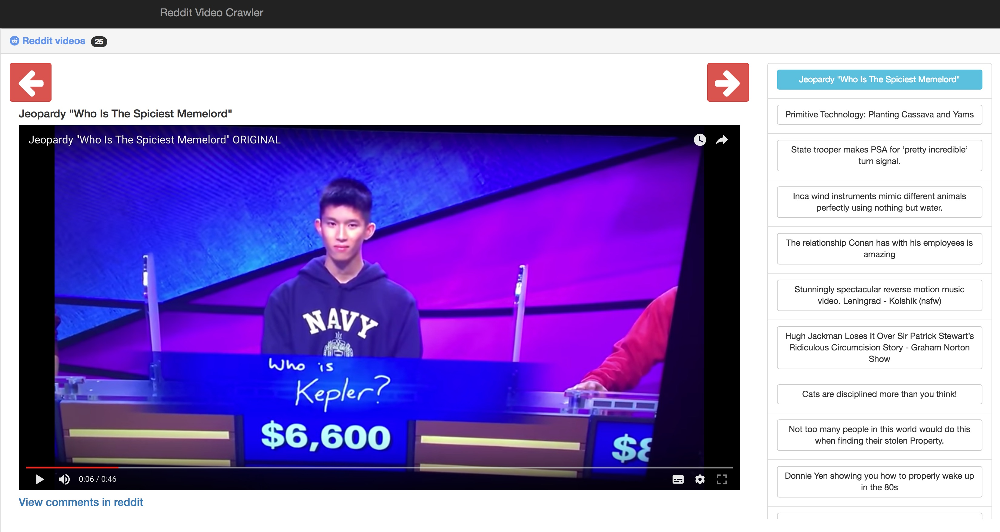

# Reddit /r/video Player with Keyboard Shortcuts

## Overview

Live version on [http://axsauze.github.io/reddit-video-crawler/](http://axsauze.github.io/reddit-video-crawler/).

The **Reddit /r/video Player** is a simple video player that let's users play all the videos in **/r/videos/top**.

The objective of this project is to make your procrastination more productive. Currently the app contains keyboard shortcuts to let you navigate.

This project is open souce, so feel free to contribute.

### Keyboard shortcuts

* **Next video:** ArrowDown, ArrowRight, n, j, l
* **Previous video:** ArrowLeft, ArrowUp, p, k, h
* **Open Comments:** c

## Architecture overview

The project is build with a frontend in Angular 2. For the backend we decided to just use a google spreadsheet instead that just crawls for the top links in /r/videos **every 30 minutes**.

## Roadmap

* Use youtube API when possible instead of just iframes
* Play next video automatically when current video finishes

We are open to suggestions! Feel free to add an issue for feature requests, or submit a pull request!

